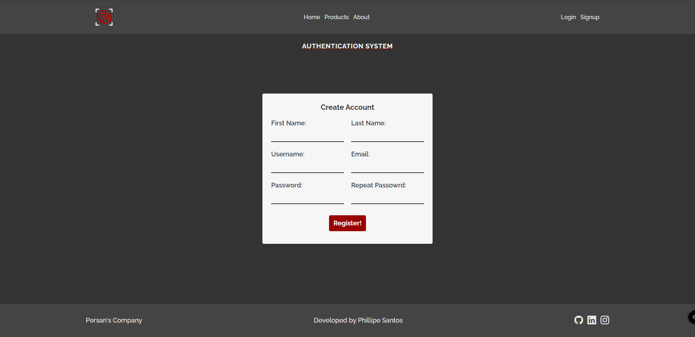

# Django Authentication

Django & Tailind Authentication App


## Screenshots




## Features

- Custom User Model
- Login & Logout
- Create User Account
- Full Stack App


## 🚀 About Me
I'm a full stack developer...


## Installation

Install with Python Virtual Enviroment (venv)

```bash
  python -m venv venv
  .\venv\Scripts\activate
  pip install -r requirements.txt
```
Migrate to DataBase

```bash
  python manage.py makemigrations
  python manage.py migrate
```

Create a Super User
```bash
  python manage.py createsuperuser
```

Install NodeJS dependencies
```bash
  npm install
```